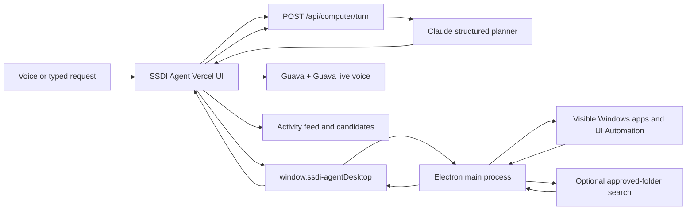

# Design Document: SSDI Agent Computer Use MVOP

## Overview

SSDI Agent keeps the existing Next.js/Vercel application as the visible product and uses Electron as its Windows execution boundary. The web application owns conversation, SSDI case state, agent orchestration, results, and narration. Electron owns Windows UI Automation, bounded input actions, verified evidence, and case-folder export. Claude chooses typed actions from active-window accessibility descriptions and arbitrary requests; it never receives unrestricted shell access.

This design implements Requirements C1-C13. Browser automation, credential entry, destructive actions, uploads, and SSA submission remain excluded.

## Design Principles

1. **Real tools, never staged output.** A successful statement requires a successful native result.
2. **Generic intent, narrow capabilities.** Language is open-ended; executable tools are typed and constrained.
3. **Local first.** Traverse, parse, OCR, and preview locally; share only bounded excerpts.
4. **Narrate state, not theater.** Speech reflects actual action events and counts.
5. **Preserve the working application.** Computer use is an extension of the current workspace, not a rewrite.

## Technology Stack

| Concern | Choice | Requirements |
| --- | --- | --- |
| Hosted interface | Existing Next.js App Router on Vercel | C1, C7, C11 |
| Windows shell | Electron `BrowserWindow` and preload `contextBridge` | C2, C8 |
| Planner | Claude structured JSON with Zod validation | C3, C9 |
| Local execution | Electron desktop capture plus PowerShell/.NET UI Automation and SendInput | C4, C8, C12 |
| PDF text | `pdf-parse` | C4, C5 |
| Image OCR | `tesseract.js`, English worker | C4, C5 |
| Voice orchestration | Guava WebRTC session | C3, C10, C11 |
| Speech input/output | Guava Scribe realtime and Flash v2.5 through Guava | C6, C11 |
| Forms and export | Anvil adapters, `fflate`, and native case-folder creation | C11, C13 |

## High-Level Architecture



The loop continues until the planner returns `finish`, `clarify`, or `error`, or the client reaches its action/time limit.

## Runtime Flow

### 1. Desktop bootstrap (C2, C8)

1. Electron resolves `--url`, `SSDI_AGENT_WEB_URL`, or the deployed default.
2. It derives one allowed origin and refuses navigation elsewhere.
3. It creates a sandboxed `BrowserWindow` with a preload file.
4. The preload exposes only named SSDI Agent computer, evidence-link, stop, and case-export methods.
5. IPC handlers reject calls whose sender origin differs from the configured origin.

### 2. Windows observation (C2, C5)

1. The renderer detects `window.ssdi-agentDesktop`.
2. Electron captures the visible primary display and the active window's UI Automation tree.
3. The hosted planner receives that bounded observation for the current action only.
4. File access is granted only when a real File Explorer selection is registered during the session.

### 3. Request planning (C3, C9)

1. The existing voice hook transcribes the request, or the user types it.
2. The renderer sends the request, locale, sanitized environment, recent turns, prior tool result, and active-window UI Automation descriptions to `/api/computer/turn`.
3. Claude returns one schema-validated `Computer_Turn_Response`.
4. The renderer either invokes one tool, presents a grounded result, asks a necessary clarification, or reports failure.

### 4. Visible local-file discovery (C4, C5)

1. The planner opens and navigates File Explorer through UI Automation or bounded screen coordinates.
2. The person sees every search, selection, and opened preview on their desktop.
3. The planner verifies a likely document from its filename, extracted contents, or visible contents instead of loose keyword overlap.
4. `register_selected_file` reads the current Explorer selection and returns an opaque candidate ID.
5. Later candidate actions may extract, preview, open, or link only that registered file.

### 5. Activity and narration (C6)

Native execution emits factual `Activity_Event` objects. The renderer appends each event to an `aria-live` activity list. Important events enter a serialized TTS queue. The queue never invents counts and does not block execution if speech fails.

### 6. Result use (C7)

Candidate cards show actual filename, display path, modification time, and match evidence. Supported images can be previewed from bounded data returned by Electron. `open_candidate` uses the recorded candidate path; the renderer cannot provide a path. An optional in-memory association links the candidate to a current checklist need.

## Interfaces

```ts
type ComputerToolName =
  | "observe_windows"
  | "open_file_explorer"
  | "launch_app"
  | "focus_window"
  | "invoke_element"
  | "click"
  | "type_text"
  | "press_keys"
  | "scroll"
  | "wait"
  | "register_selected_file"
  | "extract_text"
  | "preview_candidate"
  | "open_candidate";

interface ApprovedRoot {
  id: string;
  name: string;
  displayPath: string;
}

interface ComputerEnvironment {
  platform: "win32";
  release: string;
  arch: string;
  roots: ApprovedRoot[];
  capabilities: ComputerToolName[];
  limits: {
    maxFiles: number;
    maxDepth: number;
    maxFileBytes: number;
    maxExcerptCharacters: number;
  };
}

type ComputerToolRequest =
  | { tool: "observe_windows"; args: Record<string, never> }
  | { tool: "open_file_explorer"; args: { location: "home" | "downloads" | "documents" | "desktop" } }
  | { tool: "launch_app"; args: { app: string } }
  | { tool: "focus_window"; args: { title: string } }
  | { tool: "invoke_element"; args: { elementId: string } }
  | { tool: "click"; args: { x: number; y: number } }
  | { tool: "type_text"; args: { text: string } }
  | { tool: "press_keys"; args: { keys: string[]; repeats: number } }
  | { tool: "scroll"; args: { direction: "up" | "down"; amount: number } }
  | { tool: "wait"; args: { milliseconds: number } }
  | { tool: "register_selected_file"; args: Record<string, never> }
  | { tool: "extract_text"; args: { candidateId: string } }
  | { tool: "preview_candidate"; args: { candidateId: string } }
  | { tool: "open_candidate"; args: { candidateId: string } };

interface CandidateFile {
  id: string;
  name: string;
  displayPath: string;
  extension: string;
  size: number;
  modifiedAt: string;
  score: number;
  evidence: string[];
  excerpt?: string;
  previewDataUrl?: string;
}

interface ActivityEvent {
  id: string;
  phase: "started" | "progress" | "completed" | "failed";
  message: string;
  speak: boolean;
  createdAt: string;
}
```

`POST /api/computer/turn` accepts at most twelve history items and one bounded tool result. It returns:

```ts
type ComputerTurnResponse =
  | { state: "act"; narration: string; action: ComputerToolRequest }
  | { state: "finish"; narration: string; candidateIds: string[] }
  | { state: "clarify"; narration: string }
  | { state: "error"; narration: string };
```

## Security and Privacy

- Renderer Node integration is disabled; context isolation, sandboxing, and web security remain enabled.
- IPC validates sender origin, request shape, root IDs, candidate IDs, canonical path containment, size limits, and supported extensions.
- No tool accepts commands, scripts, URLs, or renderer-selected absolute paths.
- Directory traversal skips symbolic links and known high-volume development/system folders.
- The server caps requests and excerpts, uses no-store responses, and does not log request contents or tool results.
- Local paths and candidate maps remain in Electron memory only.

## Correctness Properties

1. **Property P1 — Path authority (C2, C8, C12):** every inspected candidate resolves beneath an active Approved_Root or comes from a real selected File Explorer item registered in the current session.
2. **Property P2 — Result provenance (C3, C10):** every returned candidate ID originated in the current native candidate map.
3. **Property P3 — No false success (C4, C6, C9):** a finish response with candidates is displayed only when those IDs exist in a successful tool result.
4. **Property P4 — Request independence (C3, C10):** changing the natural-language request changes runtime intent without requiring a code or configuration change.
5. **Property P5 — Bounded disclosure (C5):** no server-bound excerpt exceeds the configured character limit and no preview data is sent to the planner.
6. **Property P6 — Bounded execution (C9):** one request performs no more than twenty native actions or three minutes.
7. **Property P7 — Narration truth (C6):** factual numbers in narration are sourced from tool results or activity events.
8. **Property P8 — Case isolation (C7, C11):** computer-agent state changes do not mutate confirmed Applicant_Case facts.

## Error Handling

- **No desktop bridge:** retain voice/forms and explain how to open SSDI Agent Desktop.
- **No approved roots:** stop before planning a file action and offer the folder picker.
- **Access denied or locked file:** skip the file, count the failure, and continue within limits.
- **Unsupported/encrypted file:** label it unsupported; never treat it as a match from content.
- **OCR/parser failure:** preserve metadata evidence and report that content could not be read.
- **Claude failure:** preserve activity and results; offer retry or a new request.
- **Guava or Guava failure:** continue visually and retain typed input.
- **Action/time limit:** terminate with an honest partial-results message.

## Testing Strategy

### Visible Windows agent (C12)

SSDI Agent Desktop owns a native Windows controller. Each turn reads the active window's UI Automation controls. The hosted planner returns one typed action; Electron executes it through a fixed PowerShell/.NET bridge using UI Automation and SendInput, waits for the UI to settle, and reads the next real accessibility observation. Hidden file indexing is not part of the planner path.

File Explorer selections cross the trust boundary through `register_selected_file`. The native layer reads the actual selected path, creates an opaque Candidate_File, and only then allows the web application to present or link it.

### Case-folder export (C13)

The archive route generates separate PDF assets for the four SSA forms and evidence index. SSDI Agent Desktop validates and extracts those assets into a newly created user-chosen directory, copies linked evidence with collision-safe names, writes `Missing supporting documents.txt` and `README.txt`, then opens the completed folder. Source evidence is copied, never moved.

- Unit-test Zod contracts, path containment, traversal bounds, token scoring, excerpt caps, candidate IDs, and response-state validation.
- Component-test bridge absent/connected states, folder consent, activity order, TTS failure, results, and keyboard access.
- Integration-test the planner with mocked real tool results and ensure it cannot claim undiscovered files.
- Run a fresh-input test using newly created, poorly named files whose contents determine the match.
- Run the existing voice, extraction, case, packet, accessibility, typecheck, and production-build suites.
